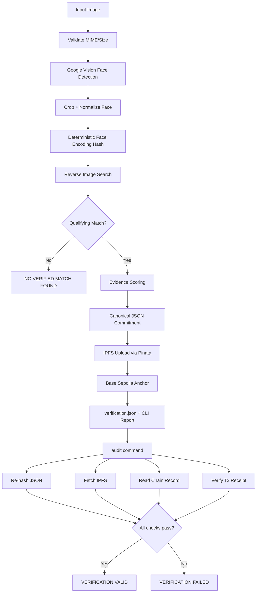

# Architecture

## Overview

HH Goa Verification Engine is a CLI-first pipeline that produces tamper-evident provenance records for consenting demo subjects.



## Module Layout

```
src/
  cli/           Commander entry + HH Goa branded terminal UI
  pipeline/      Orchestrates the 8-step verify flow
  face/          Google Cloud Vision face detection + crop
  reverse-search/ Provider abstraction (Google Vision Web Detection, SerpAPI)
  evidence/      Scoring, canonical record builder
  hashing/       SHA-256 + canonical JSON
  ipfs/          Pinata upload + gateway fetch
  blockchain/    viem client, VerificationRegistry interaction
  audit/         Independent re-verification
  config/        Brand tokens, env loading
  utils/         Image I/O, URL validation, errors
```

## Commitment Model

The on-chain `recordHash` commits to the **committable payload** — everything except `integrity`, `storage`, and `blockchain` metadata:

- Input image metadata (SHA-256, dimensions)
- Face detection results (bbox, confidence, encoding hash)
- Full reverse-image search response (runtime-fetched)
- Selected evidence + transparent score breakdown

IPFS stores the committable JSON. The chain stores `recordHash` + `ipfsCid` + timestamp.

## Provider Abstraction

```
ReverseImageProvider
  ├── GoogleVisionWebDetectionProvider (primary)
  └── SerpApiLensProvider (optional secondary)
```

Normalized output shape enables provider swapping without changing the evidence layer.

## Why No Website

Per official Task #3 requirements, judges evaluate the pipeline itself — not a hosted UI.
