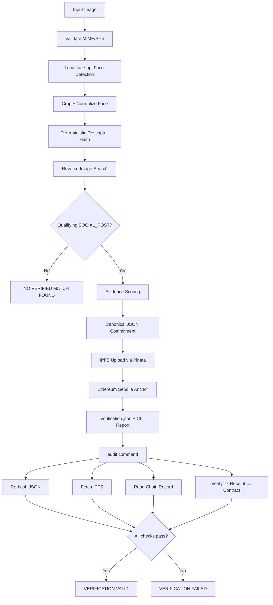
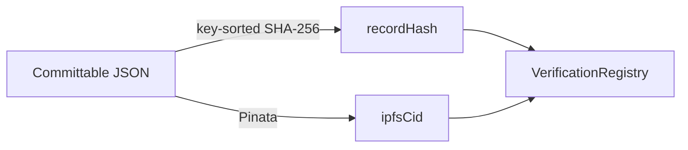
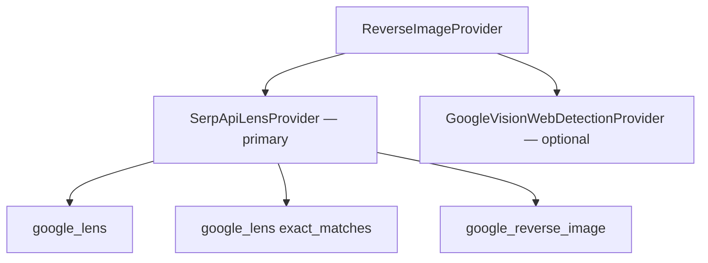

# Architecture

## Overview

**Face ID + Blockchain Verification** is a CLI-first pipeline that produces tamper-evident provenance records for consenting demo subjects (HH Goa 2026 Task #3).



## Module Layout

```
src/
  cli/            Commander entry + HH Goa branded terminal UI
  pipeline/       Orchestrates the 8-step verify flow
  face/           Local @vladmandic/face-api detection + crop + descriptor hash
  reverse-search/ Provider abstraction (SerpAPI Lens primary, Vision optional)
  evidence/       Scoring, URL classification, canonical record builder
  hashing/        SHA-256 + deterministic key-sorted JSON
  ipfs/           Pinata upload + gateway fetch
  blockchain/     viem client, VerificationRegistry interaction
  audit/          Independent re-verification
  config/         Brand tokens, env loading + validation
  utils/          Image I/O, URL helpers, errors
```

## Commitment Model

The on-chain `recordHash` commits to the **committable payload** — everything except `integrity`, `storage`, and `blockchain` metadata:

- Input image metadata (SHA-256, dimensions)
- Face detection results (bbox, confidence, encoding hash)
- Full reverse-image search response (runtime-fetched)
- Selected evidence + transparent score breakdown

IPFS stores the committable JSON. The chain stores `recordHash` + `ipfsCid` + timestamp.



## Provider Abstraction



Normalized output shape enables provider swapping without changing the evidence layer.

## Why No Website

Per official Task #3 requirements, judges evaluate the pipeline itself — not a hosted UI.
