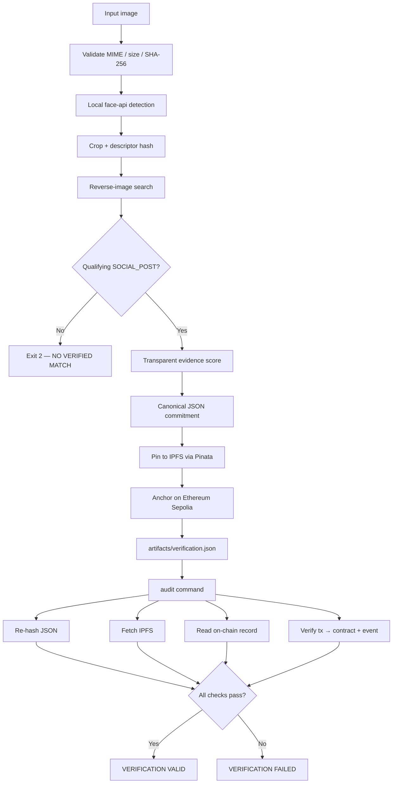
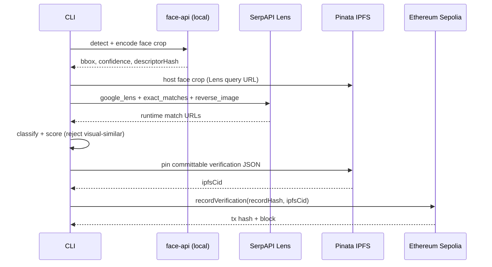
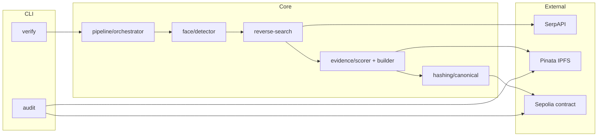
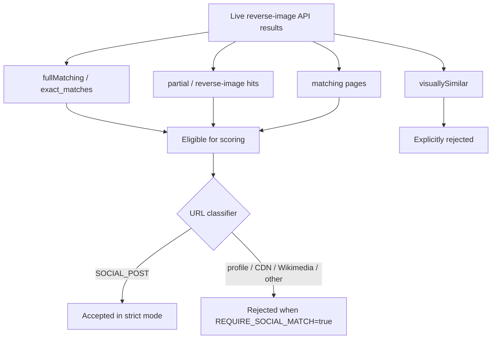
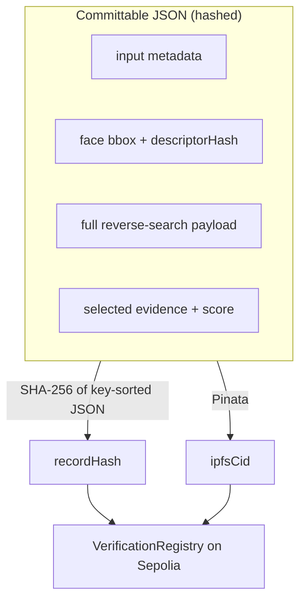

# Face ID + Blockchain Verification

> **Hacker House Goa 2026 — Task #3**  
> *Less Noise. More Signal.*

CLI-first provenance pipeline: detect a face → discover a **genuine** reverse-image social match at runtime → pin evidence on **IPFS** → anchor a tamper-evident commitment on **Ethereum Sepolia** → independently **audit** every claim.

```
╭────────────────────────────────────────────╮
│        HH GOA // VERIFICATION ENGINE       │
│          FACE × WEB × CHAIN                │
╰────────────────────────────────────────────╯
```

**Repo:** [nishant-uxs/face-id-blockchain-verification](https://github.com/nishant-uxs/face-id-blockchain-verification)  
**Claim language:** *"Evidence found for a matching image/page"* — **not** proof of personal identity.

---

## Why this submission

| Judge concern | How this repo answers |
|---|---|
| Hardcoded social URLs / fake txs? | `npm run self-test` scans `src/`; evidence comes only from live APIs |
| Visually-similar spam as “match”? | Explicitly rejected — only full / partial / page matches score |
| Profile / CDN / Wikimedia as “post”? | URL classifier requires `SOCIAL_POST` when `REQUIRE_SOCIAL_MATCH=true` |
| Trust the JSON alone? | `npm run audit` re-hashes, re-fetches IPFS, re-reads chain + receipt |
| Biometrics on-chain? | Chain stores only `recordHash` + `ipfsCid` — never embeddings or raw photos |

---

## Pipeline at a glance



### Sequence (happy path)



---

## Quick start

```bash
git clone https://github.com/nishant-uxs/face-id-blockchain-verification.git
cd face-id-blockchain-verification
npm install
cp .env.example .env
# Fill SERPAPI_KEY, PINATA_JWT, PRIVATE_KEY, CONTRACT_ADDRESS

npm run deploy                              # once — writes CONTRACT_ADDRESS
npm run verify -- ./samples/demo.jpg        # full 8-step pipeline
npm run audit -- ./artifacts/verification.json --image ./samples/demo.jpg
```

**Node:** `>=20` and `<=22` (see `package.json` engines).

---

## Environment

| Variable | Required | Description |
|---|---|---|
| `SERPAPI_KEY` | Yes* | Primary reverse-image provider (Google Lens + reverse image) |
| `PINATA_JWT` | Yes | IPFS uploads + temporary public URL for Lens queries |
| `PINATA_GATEWAY` | No | Default `gateway.pinata.cloud` |
| `PRIVATE_KEY` | Yes (verify) | Ethereum Sepolia testnet key (`0x` + 64 hex) |
| `CONTRACT_ADDRESS` | Yes | Deployed `VerificationRegistry` |
| `RPC_URL` | No | Default public Ethereum Sepolia RPC |
| `GOOGLE_APPLICATION_CREDENTIALS` | No | Optional Vision **Web Detection** secondary provider |
| `REQUIRE_SOCIAL_MATCH` | No | Default **`true`** — only `SOCIAL_POST` URLs count |
| `FACE_SELECTION` | No | `largest` (default) or `first` |
| `MAX_IMAGE_BYTES` | No | Default `10485760` (10 MB) |

\* Or Google Vision credentials for reverse search only. **Face detection is local** (`@vladmandic/face-api`) — Vision billing is **not** required for the happy path.

---

## Commands

| Command | Purpose |
|---|---|
| `npm run verify -- <image>` | Run the 8-step pipeline |
| `npm run audit -- <json> [--image ]` | Independent integrity audit |
| `npm run deploy` | Compile + deploy `VerificationRegistry.sol` |
| `npm run prepare-demo -- <src> <out>` | Crop/normalize a demo face image |
| `npm run compare-providers -- <image>` | Live provider smoke-check before recording |
| `npm run self-test` | Anti-hardcoding repository scan |
| `npm test` | Offline unit + tamper tests |
| `npm run test:failure` | Failure-mode scripts |

### Exit codes (`verify`)

| Code | Meaning |
|---|---|
| `0` | `VERIFIED` — evidence found, IPFS pinned, chain anchored |
| `1` | Pipeline / config / infra error |
| `2` | `NO VERIFIED MATCH FOUND` — no fake record written |

---

## Architecture



| Module | Responsibility |
|---|---|
| `src/face/` | Local SSD MobileNet face detect + 128-D descriptor hash (no raw embedding on chain) |
| `src/reverse-search/` | Provider interface; SerpAPI Lens primary; Vision Web Detection optional |
| `src/evidence/` | URL classification, transparent scoring, commitment JSON |
| `src/ipfs/` | Pinata pin + gateway fetch |
| `src/blockchain/` | viem wallet/public clients + `VerificationRegistry` |
| `src/audit/` | Re-verify hash, IPFS, social classification, receipt → contract |

See [ARCHITECTURE.md](./ARCHITECTURE.md) for commitment model details.

---

## What counts as evidence?



| Result type | Accepted? |
|---|---|
| Exact / full matches | Yes (strongest) |
| Partial / reverse-image pages | Yes (lower) |
| Matching pages (with stronger signals) | Yes |
| Visually similar only | **No** |
| Hardcoded URL in source | **No** — self-test fails |

---

## Commitment model



- **IPFS:** full committable verification document  
- **On-chain:** `recordHash`, `ipfsCid`, `timestamp`, `submitter`  
- **Never on-chain:** raw images, face embeddings, API keys  

Hashing uses **deterministic key-sorted JSON** (not full RFC 8785 JCS).

---

## Why Ethereum Sepolia?

- Public EVM testnet (`chainId` `11155111`) with reliable faucet access  
- Explorer: [sepolia.etherscan.io](https://sepolia.etherscan.io)  
- Pipeline **asserts** RPC `chainId` before anchoring (wrong RPC → hard fail)

---

## Demo workflow

Consenting subject must have a **public social post** of the same photo (post URL, not only a profile DP), indexed by Lens / reverse image.

```bash
npm run prepare-demo -- ./path/to/photo.jpg ./samples/demo.jpg
npm run compare-providers -- ./samples/demo.jpg   # expect SOCIAL_POST
npm run verify -- ./samples/demo.jpg
npm run audit -- ./artifacts/verification.json --image ./samples/demo.jpg
```

Full screen-recording script: [DEMO.md](./DEMO.md).

---

## Anti-hardcoding guarantees

1. Reverse search calls SerpAPI / Vision over the network  
2. Evidence URLs are selected only from that response  
3. `REQUIRE_SOCIAL_MATCH=true` by default  
4. `npm run self-test` fails on social URLs / fake tx patterns in `src/`  
5. Audit re-classifies the selected URL and checks `receipt.to === contract`

---

## Security & privacy

Designed for **consenting demo subjects** only.

- Temporary **face-crop JPEG** may be pinned publicly so Google Lens can fetch a query URL (Pinata gateway) — see [SECURITY.md](./SECURITY.md)  
- Descriptor stored is a **hash**, not a recognition template database  
- Rotate any keys that were ever pasted into chat or screenshots  

---

## Tests

```bash
npm test              # 24 offline tests (hashing, scoring, classifier, tamper)
npm run self-test     # repository anti-hardcoding scan
npm run test:failure  # failure-mode harness
```

---

## Documentation map

| Doc | Contents |
|---|---|
| [ARCHITECTURE.md](./ARCHITECTURE.md) | System design + module map |
| [RESEARCH.md](./RESEARCH.md) | Provider / stack evaluation |
| [DEMO.md](./DEMO.md) | Unedited recording checklist |
| [SECURITY.md](./SECURITY.md) | Privacy boundary + threat model |
| [LIMITATIONS.md](./LIMITATIONS.md) | Honest constraints |
| [E2E_VALIDATION.md](./E2E_VALIDATION.md) | Live validation checklist |

---

## License

MIT — built for [Hacker House Goa 2026](https://hhgoa.com/) Task #3.
