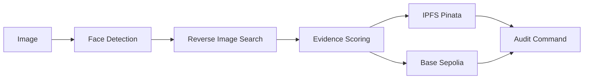

# HH Goa 2026 — Face ID + Blockchain Verification Engine

> **Less Noise. More Signal.**  
> A CLI-first verification pipeline for [Hacker House Goa 2026 Task #3](https://hhgoa.com/).

Detect a face → find genuine reverse-image evidence on the public web → anchor a tamper-evident commitment on **Base Sepolia** with **IPFS** storage → independently **audit** the result.

```
╭────────────────────────────────────────────╮
│        HH GOA // VERIFICATION ENGINE       │
│          FACE × WEB × CHAIN                │
╰────────────────────────────────────────────╯
```

## What does this project do?

Takes a consenting demo subject's photo and produces a **verifiable provenance record**:

1. Validates and hashes the input image
2. Detects and encodes a face (Google Cloud Vision)
3. Performs **genuine reverse-image search** (no hardcoded URLs)
4. Selects evidence with a **transparent score breakdown**
5. Uploads the verification JSON to **IPFS** (Pinata)
6. Anchors `recordHash + ipfsCid` on **Base Sepolia**
7. Supports independent **audit** of every step

**Claim:** *"Evidence found for a matching image/page"* — **not** proof of personal identity.

## Quick Start

```bash
npm install
cp .env.example .env
# Fill in credentials (see below)

npm run deploy          # Deploy VerificationRegistry to Base Sepolia
npm run verify -- ./samples/demo.jpg
npm run audit -- ./artifacts/verification.json --image ./samples/demo.jpg
```

## Environment Variables

| Variable | Required | Description |
|---|---|---|
| `GOOGLE_APPLICATION_CREDENTIALS` | Yes* | Path to GCP service account JSON (Vision API) |
| `PINATA_JWT` | Yes | Pinata API JWT for IPFS uploads |
| `PINATA_GATEWAY` | No | IPFS gateway domain (default: `gateway.pinata.cloud`) |
| `RPC_URL` | No | Base Sepolia RPC (default: `https://sepolia.base.org`) |
| `PRIVATE_KEY` | Yes | Testnet wallet private key |
| `CONTRACT_ADDRESS` | Yes | Deployed VerificationRegistry address |
| `SERPAPI_KEY` | No | Optional secondary reverse-search provider |
| `REQUIRE_SOCIAL_MATCH` | No | `true` to require social-domain evidence |

\* Or `SERPAPI_KEY` for reverse search only — face detection still requires Google Vision.

## Commands

| Command | Description |
|---|---|
| `npm run verify -- <image>` | Run full 8-step pipeline |
| `npm run audit -- <json> [--image ]` | Independently verify a record |
| `npm run deploy` | Compile + deploy Solidity contract |
| `npm run prepare-demo -- <src> <out>` | Crop face for demo input |
| `npm run self-test` | Anti-hardcoding repository scan |
| `npm test` | Unit tests |

## Architecture



See [ARCHITECTURE.md](./ARCHITECTURE.md) for full details.

## What counts as a genuine match?

| Match Type | Accepted as Evidence? |
|---|---|
| `fullMatchingImages` | ✅ Yes (strongest) |
| `partialMatchingImages` | ✅ Yes (lower score) |
| `pagesWithMatchingImages` | ✅ Yes |
| `visuallySimilarImages` | ❌ No — explicitly rejected |

Evidence must come from a **runtime API response**, never hardcoded.

## Why this is not hardcoded

- `npm run self-test` scans `src/` for social URLs, fake tx hashes, mock providers
- Reverse-image providers call external APIs (`annotateImage`, SerpAPI `fetch`)
- Evidence URLs are selected at runtime from API results
- Audit re-fetches IPFS and reads on-chain state independently

## What is stored where?

| Location | Data |
|---|---|
| **IPFS** | Committable verification JSON (metadata, search results, evidence) |
| **On-chain** | `recordHash`, `ipfsCid`, `timestamp`, `submitter` |
| **Never on-chain** | Raw face embeddings, API keys, full images |

## Why Ethereum Sepolia?

- Real EVM public testnet (chainId `11155111`)
- Easy faucet access for demos (no Base mainnet-balance gate)
- Official explorer at [sepolia.etherscan.io](https://sepolia.etherscan.io)
- viem / Solidity tooling works unchanged

## Demo

See [DEMO.md](./DEMO.md) for the full screen-recording workflow.

```bash
npm run prepare-demo -- ./samples/source.jpg ./samples/demo.jpg
npm run verify -- ./samples/demo.jpg
npm run audit -- ./artifacts/verification.json --image ./samples/demo.jpg
```

## What happens if no match is found?

The pipeline exits with:

```
NO VERIFIED MATCH FOUND
```

No fake verification record is written. No blockchain transaction is submitted.

## Documentation

- [RESEARCH.md](./RESEARCH.md) — API evaluation and technology choices
- [ARCHITECTURE.md](./ARCHITECTURE.md) — System design
- [LIMITATIONS.md](./LIMITATIONS.md) — Known constraints
- [DEMO.md](./DEMO.md) — Demo preparation guide
- [SECURITY.md](./SECURITY.md) — Privacy and security model

## License

MIT
